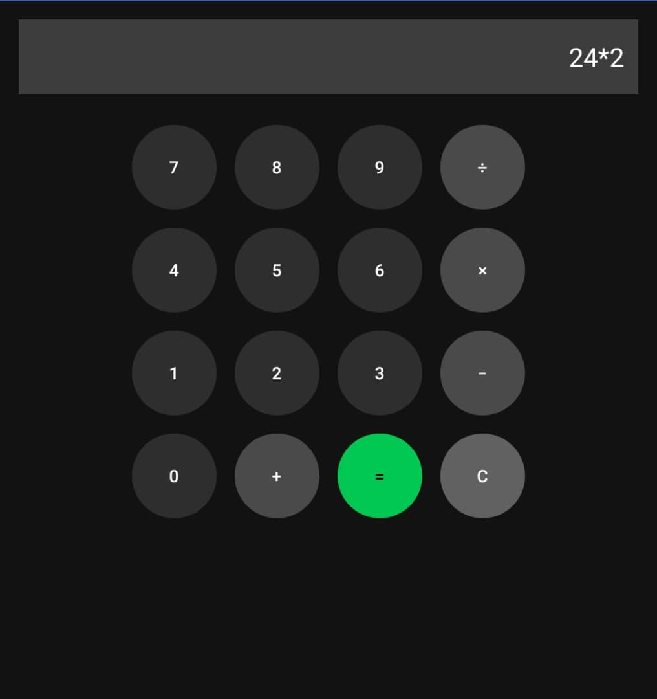

# FOCTESTAPP2 

A simple Android app built with **Kotlin** and **Android Studio**.  
This project is mainly for practice and learning, but it also demonstrates **UI layouts, fragments, gallery integration, and product display**.

---

## ✨ Features

- **Calculator**
  - Circular calculator buttons (styled with Material Design)
  - Supports +, −, ×, ÷, = and clear
- **Profile**
  - Avatar image (clickable → opens gallery to pick a picture)
  - Username displayed below avatar
  - Edit button aligned to the right
- **Products**
  - Add product image, title, and description manually
  - "Buy Now" button fixed at the bottom of the screen
- **Custom App Icon**
  - Supports adaptive icons with your own image

---

## 🚀 Getting Started

### Prerequisites
- [Android Studio](https://developer.android.com/studio) (latest version recommended)  
- JDK 17 or higher  
- Git installed on your system  

### Installation
1. Clone this repository:
   git clone https://github.com/shakurrrr/FOCTESTAPP2.git

2. Open the project in **Android Studio**.
3. Let **Gradle** sync automatically.
4. Run the app on:

   * Android Emulator
   * Or a physical Android device with USB debugging enabled

## 📂 Project Structure

FOCTESTAPP2/
│
├── app/
│   ├── src/main/java/com/example/foc_test_app/   # Kotlin source code
│   ├── src/main/res/
│   │   ├── layout/       # XML layouts (UI screens)
│   │   ├── drawable/     # Shapes, backgrounds, styles
│   │   ├── mipmap-*/     # App icons
│   │   └── values/       # Strings, colors, themes
│   └── AndroidManifest.xml
│
└── README.md

## 🛠️ Usage Guide

### 🔢 Calculator

* Tap the number and operator buttons to perform calculations.
* Press `=` to evaluate.
* Press `C` to clear the display.

### 👤 Profile

* Tap the avatar to open your **gallery** and select a picture.
* Username appears **below the avatar**.
* "Edit" button is aligned to the right.

### 🛒 Products

* Enter a product **image, title, and description** manually.
* "Buy Now" button stays at the bottom of the screen.

---

## 🎨 Custom App Icon

If you want to set your own **app logo**:

1. Prepare your logo as a **PNG file (512x512)**.
2. In Android Studio:

   * Right-click `res` → **New → Image Asset**
   * Choose **Launcher Icons (Adaptive and Legacy)**
   * Select your image
   * Set foreground/background layers
   * Save (this will generate files in `mipmap-*/`).
3. Update your manifest to point to your new icon:

xml
<application
    android:icon="@mipmap/ic_launcher"
    android:roundIcon="@mipmap/ic_launcher_round"
    android:label="@string/app_name"
    ... >

4. Clean & Rebuild project:
   ./gradlew clean build

Now your app will show the custom logo. ✅

## 📸 Screenshots

| Calculator                                     | Profile                                  | Products                                   |
| ---------------------------------------------- | ---------------------------------------- | ------------------------------------------ |
|  |  |  |

## 🤝 Contributing

Pull requests are welcome!
For major changes, please open an issue first to discuss what you would like to change.

## 📜 License

This project is for **educational purposes**.
You are free to modify and use it as you wish.
